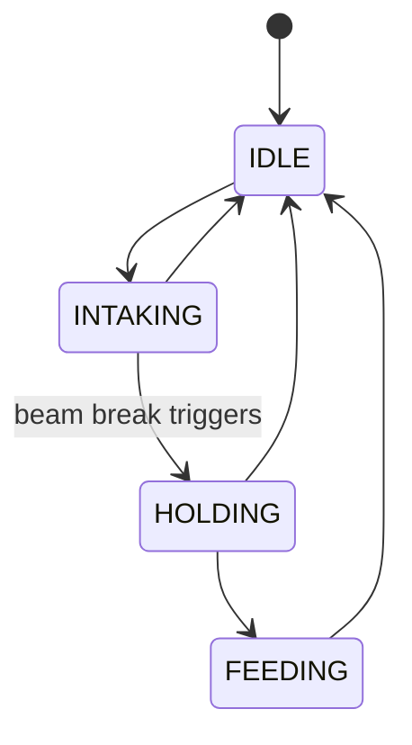
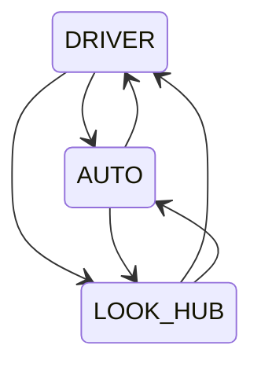
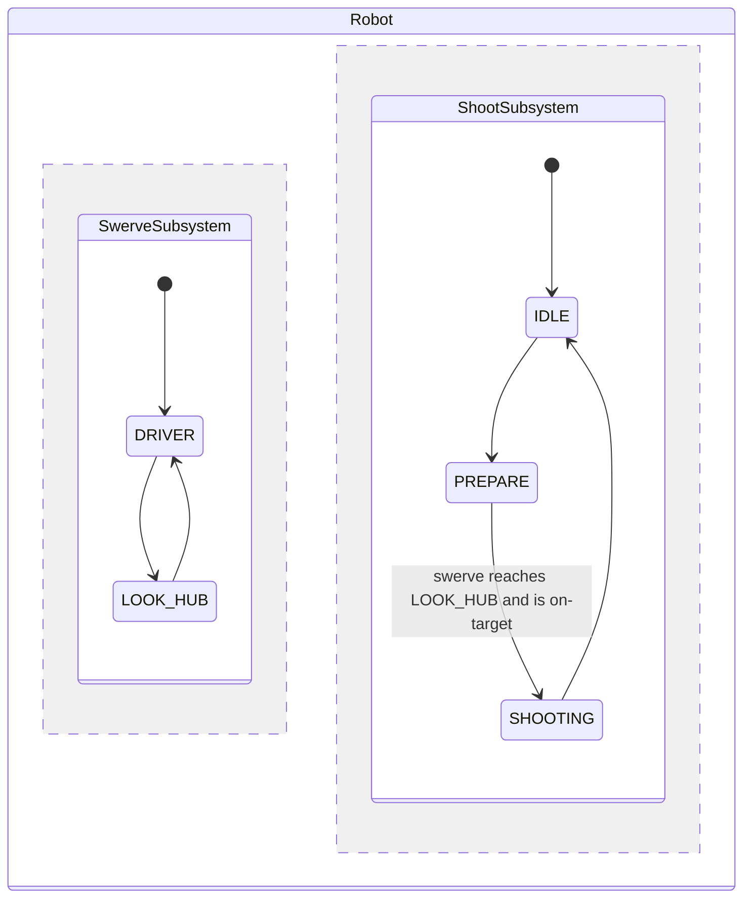

# מכונות מצבים

## מה זו מכונת מצבים, ולמה בכלל

רוב תת-המערכות, אם מתארים אותן בכנות, הן מספר קטן של *מצבים* מובחנים, בתוספת ה*אירועים* שעוברים
בינם: קולט הוא idle, או intaking, או מחזיק חלק; שילדת הינע נשלטת על ידי הנהג, או עוקבת אחר מסלול
אוטונומי, או מכוונת למטרה. כתוב כקוד רגיל, זה בדרך כלל מתגלגל לפיזור של בוליאנים ותנאי `if` -
`isIntaking`, `hasPiece`, `wasIntakingLastLoop` - שנבדקים בשילובים קצת שונים במקומות שונים, עד
שקשה באמת לדעת באילו מצבים תת-המערכת בכלל יכולה להיות, או מה אמור לקרות כשעוברים בין שניים מהם.

**מכונת מצבים** הופכת את המבנה הזה למפורש במקום מרומז. מציירים אותו כגרף:



כל תיבה היא מצב שתת-המערכת יכולה להתייצב בו; כל חץ הוא *מעבר* - משהו שרץ בזמן המעבר ממצב אחד לשני.
הכללים כותבים את עצמם ברגע שהגרף קיים: תת-המערכת נמצאת בדיוק במצב אחד בכל רגע, והיא יכולה להגיע
למצב אחר רק על ידי חץ שבאמת מצויר. אין דבר כזה מעבר לא תקין לשמור עליו בקוד, כיוון שקשת שאף פעם
לא נוספה פשוט לא היא דרך להגיע לשם.

`StateMachineBase<StateEnum>` הוא המימוש של NinjasLib לרעיון הזה: enum מפרט את כל המצבים (קודקודי
הגרף), ואתם מחברים `Command`ים ביניהם (קשתות הגרף) בתוך `define()`. היא נגזרת מ-`SubsystemBase`, כך
שברגע שהיא נבנית, ה-`periodic()` שלה רץ אוטומטית בכל לולאה דרך מתזמן הפקודות הרגיל - מקדם מעברים,
מפעיל תנאי סיום, ומריץ משימות רקע לפי מצב, כל אלה מתוארים בהמשך.

להשתמש במכונת מצבים כל פעם שההתנהגות של תת-מערכת היא באופן טבעי "במצב X, עושה Y, עד ש-Z קורה",
וכשרוצים שהמעברים התקינים - ומה שקורה בזמנם - יהיו הגדרה אחת מפורשת וקריאה במקום מצב מפוזר על
פני בוליאנים.

## הגדרת מכונת מצבים

יורשים מ-`StateMachineBase`, נותנים לה enum, ובונים את הגרף בתוך `define()`:

```java
public class Indexer extends StateMachineBase<Indexer.State> {
    public enum State { IDLE, INTAKING, HOLDING, FEEDING }

    public Indexer() {
        super(State.class);
    }

    @Override
    protected void define() {
        // פקודות מעבר A -> B. הן לא צריכות לשנות את currentState בעצמן;
        // מכונת המצבים מקדמת את המצב בעצמה כשהפקודה מסתיימת.
        addEdge(State.IDLE, State.INTAKING, Commands.runOnce(() -> motor.setPercent(0.6)));
        addEdge(State.INTAKING, State.HOLDING, Commands.runOnce(() -> motor.setPercent(0)));
        addEdge(State.HOLDING, State.FEEDING, Commands.runOnce(() -> motor.setPercent(1.0)));

        // מכל מצב, לכפות חזרה ל-IDLE:
        addOmniEdge(State.IDLE, () -> Commands.runOnce(() -> motor.setPercent(0)));

        // מעבר אוטומטי כשתנאי הופך לאמת, בלי צריך לקרוא ל-changeState() בעצמכם:
        addStateEnd(State.INTAKING, () -> beamBreak.get(), State.HOLDING);

        // פקודה שממשיכה לרוץ כל עוד מכונת המצבים נשארת ב-HOLDING:
        addStateCommand(State.HOLDING, Commands.run(() -> motor.setPercent(0.05)));
    }
}
```

- **`addEdge(start, end, command)`** מוסיף מעבר אחד. הפקודה מייצגת *מה קורה בזמן המעבר* - היא לא
  צריכה (ולא כדאי) לשנות את `currentState` בעצמה. יש overloads שמקבלים רשימות של מצבי start/end
  להוספת הרבה קשתות בבת אחת, ו-`addOmniEdge(end, ...)` מחבר כל מצב אחר ליעד אחד (שימושי למעבר
  אוניברסלי של "בטל"/"אחסן").
- **`addStateEnd(state, condition, nextState)`** מפעיל מעבר אוטומטית כש-`condition` הופך לאמת
  בזמן שנמצאים ב-`state` - בלי צריך קריאה מפורשת ל-`changeState`. התנאי יכול להיות `BooleanSupplier`,
  `Time` (חכה כך וכך זמן), או `StateEndCommand` (חכה לרצף של פקודות חכייה בלבד). **תנאי הסיום מוכרח
  לייצג המתנה לאירוע בלבד - הוא לא צריך להריץ לוגיקה אמיתית של תת-המערכת**, כיוון שהוא עלול
  להיבדק/להתבטל מחוץ למחזור החיים הרגיל של המעבר.
- **`addStateCommand(state, command)`** מריצה את `command` כל עוד המכונה מיושבת ב-`state` (מתחילה
  ברגע שהמעבר הנכנס מסתיים, נעצרת ברגע שמעבר חדש מתחיל). שימושי להחזקת זרם נמוך ברקע, נורית סטטוס,
  או התנהגות דומה של "כל עוד במצב הזה".

## הפעלת מעברים

```java
indexer.changeState(State.INTAKING);       // no-op אם כבר עוברים למצב אחר
indexer.changeStateForce(State.HOLDING);   // מנתב מחדש אפילו באמצע מעבר, ליעד החדש
indexer.forceState(State.IDLE);            // דילוג ישיר, בלי להריץ פקודת מעבר

// כ-Command, לקישור לטריגר:
controller.a().onTrue(indexer.changeStateCommand(State.INTAKING));
```

- **`changeState`** משפיע רק אם יש קשת ישירה מהמצב *הנוכחי* והמכונה לא כבר באמצע מעבר.
- **`changeStateForce`** עובד גם באמצע מעבר, ומנתב מחדש מהמצב *היעד* הנוכחי במקום - להשתמש בזה
  כשבקשה חדשה יותר צריכה לעקוף אחת שכבר בדרך.
- **`forceState`** מדלג על הגרף לחלוטין: הוא מבטל את הקשת הנוכחית ואת פקודות סיום המצב, וקופץ ישר
  למצב הנתון בלי להריץ פקודת מעבר. להשתמש בזה לאתחול או לאיפוס חירום, לא לזרימה רגילה.

## מסלולים מרובי-שלבים

`runStatesPath(target)` מוצא את המסלול הקצר ביותר (BFS) מהמצב הנוכחי ל-`target` דרך הקשתות
המוגדרות, ואז מפעיל אוטומטית כל מעבר בתורו כשהקודם מסתיים:

```java
indexer.runStatesPath(State.FEEDING); // עובר IDLE -> INTAKING -> HOLDING -> FEEDING אוטומטית
```

אם אין מסלול, או שהמכונה כבר באמצע מעבר, זה לא עושה כלום. `isRunningPath()`, `getPathTarget()`,
ו-`getCurrentPath()` מאפשרים לבדוק מסלול שבתהליך.

## שאילתת מצב

```java
indexer.getCurrentState();      // מצב מיושב, או המצב שעוברים ממנו
indexer.getTargetState();       // יעד של מעבר בתהליך, או null
indexer.isTransitioning();      // true כל עוד פקודת קשת רצה
indexer.isInStates(State.HOLDING, State.FEEDING); // בדיקת שייכות לכמה מצבים
indexer.canTransitionTo(State.FEEDING);           // יש קשת ישירה מהמצב הנוכחי?
```

## מה קורה מתחת למכסה בכל לולאה

`periodic()` (שנקרא אוטומטית כיוון שזו `SubsystemBase`) עושה ארבע פעולות בסדר הזה:

1. אם לא באמצע מעבר, בודק את תנאי `addStateEnd` של המצב הנוכחי, ומפעיל את הראשון שגם הסתיים וגם
   מוביל למצב שהגרף מתיר מעבר אליו.
2. אם פקודת המעבר הנוכחית בדיוק הסתיימה, מקבע `currentState = targetState`, מתזמן את תנאי הסיום
   של המצב החדש, ומתחיל/מפסיק את משימת הרקע (`addStateCommand`) שלו.
3. אם מסלול מרובה-שלבים בתהליך, מפעיל את השלב הבא.
4. מתעד `Is Transitioning`, `Current State`, `Target State`, ו-`Path States` דרך `NinjasLogger`
   תחת `<שם תת-המערכת>/State Machine/...`.

גרף המעברים המלא גם נדפס לקונסולה פעם אחת בבנייה (ממש אחרי ש-`define()` מסתיים), מה שהוא דרך
מהירה לבדוק שחיברתם את הקשתות שהתכוונתם.

## דפוס "המצב הרציף": omni-edges + state commands

חלק מהמצבים הם לא שלב רגעי בדרך למקום אחר - הם *מצב* מתמשך שנשאר פעיל עד שמשהו במפורש עובר ממנו.
נהיגה היא הדוגמה הברורה ביותר: שילדת הינע תמיד נשלטת בדיוק על ידי דבר אחד (הג'ויסטיקים של הנהג,
מסלול אוטונומי, שגרת כיוון-למטרה, ...), ומה שזה יהיה צריך להמשיך לרוץ בכל לולאה עד שדבר אחר משתלט.
[`SwerveSubsystem` באיך מתחילים](../getting-started.md) נבנית
בדיוק כך. הגרף שלה נראה כך:



כל מצב יכול להגיע לכל מצב אחר ישירות - שזה בדיוק מה ש-`addOmniEdge` בשבילו: `addOmniEdge(LOOK_HUB,
...)` מוסיף קשת מכל מצב *אחר* לתוך `LOOK_HUB` בקריאה אחת, כך שכל מצב יכול להעביר שליטה לכל מצב
אחר על פי דרישה. משלבים את זה עם `addStateCommand`, שמספקת את ההתנהגות שרצה ברציפות כל עוד נשארים
במצב הזה:

```java
addOmniEdge(LOOK_HUB, () -> Commands.runOnce(() -> SwerveController.get().setChannel("Look Hub")));
addStateCommand(LOOK_HUB, Commands.run(() ->
    SwerveController.get().setControl(aimAtTarget(), "Look Hub")
));
```

ה-omni-edge הוא ההעברה (בדרך כלל מיידית) לתוך המצב; ה-state command הוא המצב עצמו, מוערך מחדש בכל
לולאה עד שמשהו עובר ממנו. זאת גם הסיבה ש[שער הערוץ של `SwerveController`](swerve.md) קיים: כשכמה state commands יכולים טכנית כולם לקרוא ל-`Swerve.get().drive(...)`, בדיקת הערוץ היא
מה שמבטיח שרק ה-command של המצב *הנוכחי* מגיע בפועל למנועים.

## מכונות מצבים מרובות יכולות להתקיים יחד

אין הגבלה על כמה `StateMachineBase` יש לרובוט, והן לא צריכות לדעת אחת על השנייה כדי לעבוד נכון -
כל אחת היא `SubsystemBase` עצמאית משלה, רשומה ומופעלת על ידי מתזמן הפקודות בעצמה. מכונת מצבים של
הינע, מכונת מצבים של קולט, ומכונת מצבים של רצף ירי יכולות כולן לרוץ זו לצד זו, כל אחת עם הגרף שלה,
בלי שאף אחת מהן מודעת לקיום האחרות:



אבל לפעמים הן *כן* רוצות לתקשר - וכיוון שמכונת מצבים היא בסך הכול תת-מערכת עם API ציבורי
(`changeState`, `getCurrentState`, כל שיטה מותאמת אישית שמוסיפים), פקודת מעבר של מכונת מצבים אחת
יכולה להפעיל מכונה אחרת בדיוק כמו שהיא הייתה קוראת לכל תת-מערכת אחרת:

```java
public class ShootSubsystem extends StateMachineBase<ShootSubsystem.ShootState> {
    public enum ShootState { IDLE, PREPARE, SHOOTING }

    private final SwerveSubsystem swerve;
    private final Shooter shooter;

    public ShootSubsystem(SwerveSubsystem swerve, Shooter shooter) {
        super(ShootState.class);
        currentState = ShootState.IDLE;
        this.swerve = swerve;
        this.shooter = shooter;
    }

    @Override
    protected void define() {
        addEdge(ShootState.IDLE, ShootState.PREPARE,
            swerve.changeStateCommand(SwerveSubsystem.SwerveState.LOOK_HUB));

        // מחכה שהמכונה האחרת בפועל תגיע ליעד שלה לפני שיורים:
        addStateEnd(ShootState.PREPARE,
            () -> swerve.getCurrentState() == SwerveSubsystem.SwerveState.LOOK_HUB && swerve.atGoal(),
            ShootState.SHOOTING);

        addStateCommand(ShootState.SHOOTING, shooter.runCmd());
        addOmniEdge(ShootState.IDLE, shooter::stopCmd);
    }
}
```

`ShootSubsystem` אף פעם לא נוגע ב-`Swerve` או ב-`SwerveController` ישירות - היא קוראת רק לשיטות
הציבוריות של `SwerveSubsystem` עצמה, בדיוק כמו שכל קוד אחר היה עושה. זה אותו עיקרון כמו כל תלות
אחרת בין תת-מערכות: מעבירים את האחות (כאן, דרך הבנאי) וקוראים ל-API הציבורי שלה.

!!! note "סדר הבנייה משנה"
    `define()` רץ *בזמן* `super(StateEnum.class)`, כלומר לפני ששאר גוף הבנאי שלכם רץ. אם `define()`
    מגיע לתת-מערכת אחות - דרך פרמטר בנאי כמו למעלה, או getter סטטי כמו `RobotContainer.getSwerve()`
    - האחות הזאת חייבת כבר להתקיים ברגע שמכונת המצבים הזאת נבנית. בפועל זה אומר: לבנות מכונות
    מצבים שתלויות בתת-מערכות אחרות *אחרי* אותן תת-מערכות, ב-`RobotContainer`.
