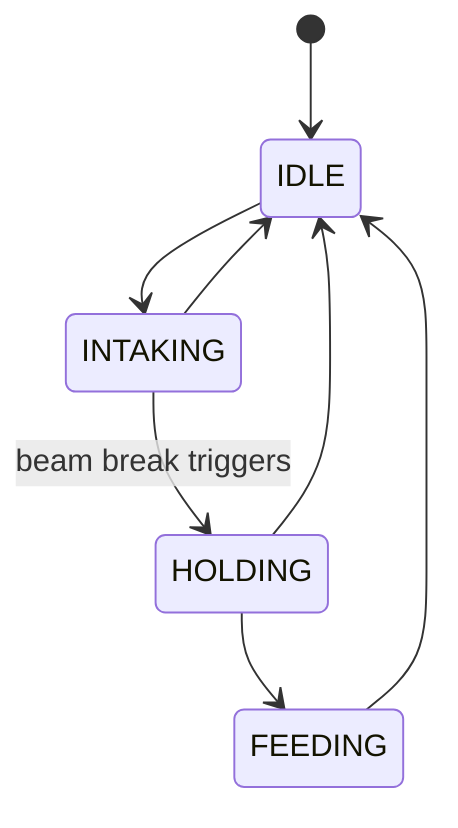
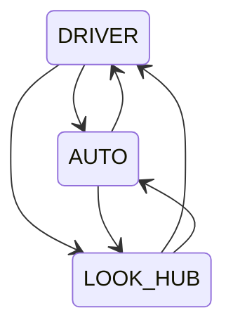
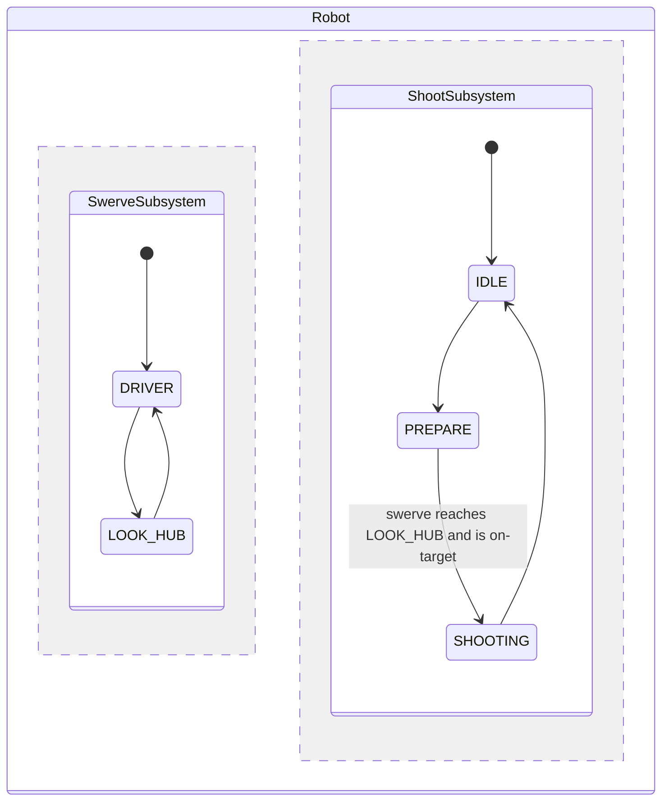

# State Machines

## What is a state machine, and why bother

Most subsystems, described honestly, are a small number of distinct *modes* plus the *events* that
move between them: an intake is idle, or intaking, or holding a piece; a drivetrain is being driven
by a controller, or following an autonomous path, or aiming at a target. Written as plain code, this
usually turns into a scatter of booleans and `if` statements — `isIntaking`, `hasPiece`,
`wasIntakingLastLoop` — checked in slightly different combinations in different places, until it's
genuinely hard to say what states the subsystem can actually be in, or what's supposed to happen when
moving between two of them.

A **state machine** makes that structure explicit instead of implicit. You draw it as a graph:



Each box is a state the subsystem can settle in; each arrow is a *transition* — something that runs
while moving from one state to the other. The rules write themselves once the graph exists: the
subsystem is in exactly one state at a time, and it can only reach another state by an arrow that's
actually drawn. There's no such thing as an invalid transition to guard against in code, because an
edge that was never added simply isn't a way to get there.

`StateMachineBase<StateEnum>` is NinjasLib's implementation of this idea: an enum lists every state
(the graph's vertices), and you wire up `Command`s between them (the graph's edges) inside `define()`.
It extends `SubsystemBase`, so once constructed, its `periodic()` runs automatically every loop
through the normal command scheduler — advancing transitions, firing timeouts, and running
per-state background tasks, all described below.

Reach for a state machine whenever a subsystem's behavior is naturally "in state X, doing Y, until Z
happens," and you want the valid transitions — and what happens during them — to be one explicit,
readable definition instead of state spread across booleans.

## Defining a state machine

Subclass `StateMachineBase`, give it an enum, and build the graph inside `define()`:

```java
public class Indexer extends StateMachineBase<Indexer.State> {
    public enum State { IDLE, INTAKING, HOLDING, FEEDING }

    public Indexer() {
        super(State.class);
    }

    @Override
    protected void define() {
        // A -> B transition commands. They don't need to change currentState themselves;
        // the state machine advances the state once the command finishes.
        addEdge(State.IDLE, State.INTAKING, Commands.runOnce(() -> motor.setPercent(0.6)));
        addEdge(State.INTAKING, State.HOLDING, Commands.runOnce(() -> motor.setPercent(0)));
        addEdge(State.HOLDING, State.FEEDING, Commands.runOnce(() -> motor.setPercent(1.0)));

        // From any state, force back to IDLE:
        addOmniEdge(State.IDLE, () -> Commands.runOnce(() -> motor.setPercent(0)));

        // Auto-transition once a condition becomes true, no explicit changeState() call needed:
        addStateEnd(State.INTAKING, () -> beamBreak.get(), State.HOLDING);

        // A command that keeps running for as long as the state machine stays in HOLDING:
        addStateCommand(State.HOLDING, Commands.run(() -> motor.setPercent(0.05)));
    }
}
```

- **`addEdge(start, end, command)`** adds one transition. The command represents *what happens while
  transitioning* — it does not need to (and should not) mutate `currentState` itself.
  Overloads accept lists of start/end states to add many edges at once, and `addOmniEdge(end, ...)`
  connects every other state to one destination (handy for a universal "abort"/"stow" transition).
- **`addStateEnd(state, condition, nextState)`** auto-fires a transition once `condition` becomes true
  while sitting in `state` — no explicit `changeState` call needed. The condition can be a
  `BooleanSupplier`, a `Time` (wait this long), or a `StateEndCommand` (wait for a sequence of
  wait-only commands). **The end condition must only represent waiting for an event — it must not run
  actual subsystem logic**, since it may be evaluated/cancelled outside the normal transition
  lifecycle.
- **`addStateCommand(state, command)`** runs `command` for as long as the machine is settled in
  `state` (started once the incoming transition finishes, stopped the moment a new transition starts).
  Useful for a low background hold current, a status light, or similar "while in this state" behavior.

## Driving transitions

```java
indexer.changeState(State.INTAKING);       // no-op if already transitioning elsewhere
indexer.changeStateForce(State.HOLDING);   // reroutes even mid-transition, to the new target
indexer.forceState(State.IDLE);            // jump directly, skipping any edge command

// As a Command, for binding to a trigger:
controller.a().onTrue(indexer.changeStateCommand(State.INTAKING));
```

- **`changeState`** only takes effect if there's a direct edge from the *current* state and the
  machine isn't already transitioning.
- **`changeStateForce`** also works while transitioning, rerouting from the current *target* state
  instead — use this when a newer request should override one still in flight.
- **`forceState`** skips the graph entirely: it cancels the current edge and any state-end commands,
  and jumps straight to the given state without running a transition command. Use it for
  initialization or emergency resets, not normal flow.

## Multi-hop paths

`runStatesPath(target)` finds the shortest path (BFS) from the current state to `target` through the
defined edges, then automatically fires each transition in turn as the previous one completes:

```java
indexer.runStatesPath(State.FEEDING); // walks IDLE -> INTAKING -> HOLDING -> FEEDING automatically
```

If no path exists, or the machine is already transitioning, this does nothing. `isRunningPath()`,
`getPathTarget()`, and `getCurrentPath()` let you inspect an in-progress path.

## Querying state

```java
indexer.getCurrentState();      // settled state, or the state being transitioned FROM
indexer.getTargetState();       // destination of an in-progress transition, or null
indexer.isTransitioning();      // true while an edge command is running
indexer.isInStates(State.HOLDING, State.FEEDING); // membership check across several states
indexer.canTransitionTo(State.FEEDING);           // is there a direct edge from the current state?
```

## What happens under the hood each loop

`periodic()` (called automatically since this is a `SubsystemBase`) does four things in order:

1. If not transitioning, checks the current state's `addStateEnd` conditions and fires the first one
   that's both finished and leads to a state the graph allows transitioning to.
2. If the current transition command just finished, commits `currentState = targetState`, schedules
   the new state's end conditions, and starts/stops its `addStateCommand` background task.
3. If a multi-hop path is in progress, kicks off the next hop.
4. Logs `Is Transitioning`, `Current State`, `Target State`, and `Path States` via `NinjasLogger`
   under `<subsystem name>/State Machine/...`.

The full transition graph is also printed to the console once at construction (right after
`define()` returns), which is a quick way to sanity-check you wired up the edges you meant to.

## The "continuous mode" pattern: omni-edges + state commands

Some states aren't a momentary step on the way somewhere else — they're an ongoing *mode* that stays
active until something explicitly switches out of it. Driving is the clearest example: a drivetrain
is always being driven by exactly one thing (the driver's joysticks, an autonomous path, an
aim-at-target routine, ...), and whichever one that is should keep running every loop until something
else takes over. [`SwerveSubsystem` in Getting Started](../getting-started.md#the-shape-of-a-ninjaslib-based-robot)
is built exactly this way. The graph for it looks like this:



Every state can reach every other state directly — which is exactly what `addOmniEdge` is for:
`addOmniEdge(LOOK_HUB, ...)` adds an edge from every *other* state into `LOOK_HUB` in one call, so any
mode can hand off to any other mode on demand. Pair that with `addStateCommand`, which supplies the
behavior that runs continuously for as long as you stay in that mode:

```java
addOmniEdge(LOOK_HUB, () -> Commands.runOnce(() -> SwerveController.get().setChannel("Look Hub")));
addStateCommand(LOOK_HUB, Commands.run(() ->
    SwerveController.get().setControl(aimAtTarget(), "Look Hub")
));
```

The omni-edge is the (usually instant) hand-off into the mode; the state command is the mode itself,
re-evaluated every loop until something transitions out. This is also why
[`SwerveController`'s channel gate](swerve.md#sharing-the-drivetrain-safely-between-commands) exists:
with several state commands all technically capable of calling `Swerve.get().drive(...)`, the channel
check is what guarantees only the *current* state's command actually reaches the motors.

## Multiple state machines can coexist

There's no limit to how many `StateMachineBase`s a robot has, and they don't need to know about each
other to work correctly — each one is its own independent `SubsystemBase`, registered with and ticked
by the command scheduler on its own. A drivetrain state machine, an intake state machine, and a
shooting-sequence state machine can all run side by side, each with its own graph, none of them aware
the others exist:



But they often *do* want to coordinate — and since a state machine is just a subsystem with a public
API (`changeState`, `getCurrentState`, whatever custom methods you add), one state machine's
transition command can drive another one exactly like it would call any other subsystem:

```java
public class ShootSubsystem extends StateMachineBase<ShootSubsystem.ShootState> {
    public enum ShootState { IDLE, PREPARE, SHOOTING }

    private final SwerveSubsystem swerve;
    private final Shooter shooter;

    public ShootSubsystem(SwerveSubsystem swerve, Shooter shooter) {
        super(ShootState.class);
        currentState = ShootState.IDLE;
        this.swerve = swerve;
        this.shooter = shooter;
    }

    @Override
    protected void define() {
        addEdge(ShootState.IDLE, ShootState.PREPARE,
            swerve.changeStateCommand(SwerveSubsystem.SwerveState.LOOK_HUB));

        // Wait for the OTHER state machine to actually reach its target before shooting:
        addStateEnd(ShootState.PREPARE,
            () -> swerve.getCurrentState() == SwerveSubsystem.SwerveState.LOOK_HUB && swerve.atGoal(),
            ShootState.SHOOTING);

        addStateCommand(ShootState.SHOOTING, shooter.runCmd());
        addOmniEdge(ShootState.IDLE, shooter::stopCmd);
    }
}
```

`ShootSubsystem` never touches `Swerve` or `SwerveController` directly — it only calls
`SwerveSubsystem`'s own public methods, the same way any other piece of code would. This is the same
principle as any other subsystem dependency: pass the sibling in (here, through the constructor)
and call its public API.

!!! note "Construction order matters"
    `define()` runs *during* `super(StateEnum.class)`, i.e. before the rest of your constructor body
    executes. If `define()` reaches for a sibling subsystem — through a constructor parameter as
    above, or a static getter like `RobotContainer.getSwerve()` — that sibling must already exist by
    the time this state machine is constructed. In practice this just means: build state machines
    that depend on other subsystems *after* those subsystems, in `RobotContainer`.
